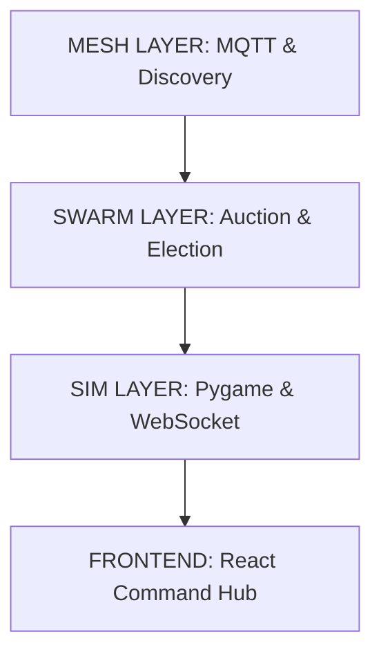

# 🦅 Project NOVA (Jatayu)
### Strategic Swarm Intelligence for Search & Rescue 

[](https://www.python.org/)
[](https://nodejs.org/)
[](https://mqtt.org/)
[](https://opensource.org/licenses/MIT)

**Project NOVA (Codename: Jatayu)** is a next-generation autonomous drone swarm simulation designed for high-stakes **Search & Rescue (SAR)**, surveillance, and tactical coordination. Utilizing decentralized **MQTT mesh networking**, **Raft-lite leader election**, and an **Auction Engine for distributed task allocation**, NOVA enables multiple agents to coordinate seamlessly in dynamic environments.

---

## 🚀 Key Features

*   **🌐 Decentralized Mesh Networking (M1)**: Robust peer discovery and multi-hop routing with simulated packet loss and blackout zones.
*   **⚖️ Distributed Task Allocation (M2)**: An **Auction Engine** where drones bid on tasks based on proximity and battery, managed by a Raft-lite elected leader.
*   **🎯 100-Task Sequential Missions**: A specialized `MissionController` that generates 100 sub-problems in a target zone, tracking completion across the entire swarm.
*   **📡 Real-time Command Hub**: A modern **React + Vite dashboard** with live telemetry, path visualization, and high-fidelity drone status.
*   **🛡️ Tactical Fail-safes**: Integrated **Emergency Stop (ESTOP)**, Manual Kill, and **Takeover Logic** where leaders re-dispatch the swarm if a crash is detected.
*   **🗺️ CRDT-based World State**: Consistent global state management using **Last-Writer-Wins (LWW)** CRDT for shared grid awareness.

---

## 🏗️ Architecture Overview

The system is partitioned into three core layers:



### Components Folder Structure
- `main.py` — **The Nervous System**. Spawns 8 drone agents and initializes the bridge.
- `mesh/` — **The Backbone**. Handles MQTT-mesh networking, vertex nodes, and chaos simulation.
- `swarm/` — **The Brain**. Contains the `AuctionEngine`, `LeaderElection`, and `CRDTMap`.
- `simulation/` — **The Body**. Pygame-based renderer for real-time visual feedback.
- `dashboard/` — **The Eyes**. Web-based tactical interface for operators.
- `ws_bridge.py` — **The Bridge**. Translates MQTT mesh internal logic to WebSocket for the UI.

---

## ⚙️ Getting Started

### Prerequisites
- **Python 3.10+** (with `pip` and virtual environment)
- **Node.js 18+** (for the dashboard)
- **MQTT Broker** (Optional: Uses Internal `MOCK` mode by default)

### Installation
```bash
# 1. Clone & Setup Python Env
python -m venv venv
source venv/bin/activate
pip install -r requirements.txt

# 2. Setup Dashboard
cd dashboard && npm install && cd ..
```

### Deployment
To launch the full NOVA stack, open two terminal windows:

**Terminal 1: Core Simulation**
```bash
source venv/bin/activate
python main.py
```

**Terminal 2: Command Hub**
```bash
cd dashboard && npm run dev
```
Open `http://localhost:5173` to access the Strategic Dashboard.

---

## 🎮 Operational Commands

Control the simulation in real-time using the **Pygame window**:

| Key | Action | Description |
|---|---|---|
| **K** | **Manual Kill** | Simulates a fatal crash for `drone_3` to test leader takeover. |
| **E** | **ESTOP** | Triggers Global Emergency Stop (Halts all drones). |
| **R** | **Reset** | Clears ESTOP and resumes flight. |
| **Mission Bar** | **Mission Switch** | (UI Bottom) Toggle between SAR, Fire, and Tactical zones. |
| **Esc** | **Quit** | Gracefully shuts down the mesh and server. |

---

## 📡 MQTT API Reference (Topic Map)

Project NOVA uses a hierarchical MQTT structure for coordination:

| Topic Pattern | Purpose |
|---|---|
| `nova/discovery` | Global discovery, hello/ack, and peer management. |
| `nova/heartbeat` | Real-time telemetry (pos, battery, role, status). |
| `nova/worldstate` | Shared grid updates (CRDT-synced). |
| `nova/tasks` | Auctions: Task posting by leader/scouts. |
| `nova/bids` | Auctions: Bidding phase. |
| `nova/election` | Raft-lite leader election and voting. |
| `nova/estop` | Safety: Global emergency stop signal. |
| `nova/mission/targets` | Mission Controller: Sequential task list broadcast. |

---

## 🎖️ The Mission Controller
The `MissionController` manages complex objectives (e.g., clearing a 100-cell search zone). When a target is selected via the Dashboard:
1.  **Generation**: 100 sub-tasks are scattered in the target vicinity.
2.  **Dispatch**: The leader selects available drones via the Auction Engine.
3.  **Halt**: Once sub-task 100 is cleared, the system triggers a **GLOBAL_MISSION_COMPLETE** signal, halting the swarm for analysis.

---

## 👥 Team & License
Project **NOVA** is open-source under the MIT License. Developed for experimental research in multi-agent systems and decentralized robotics.

> *Empowering autonomous agents through strategic coordination.*
